<div align="center">

  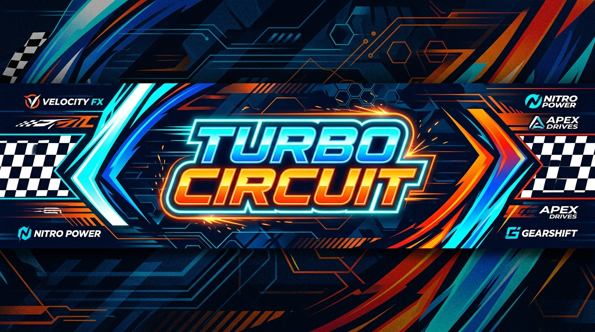

  <br/><br/>

  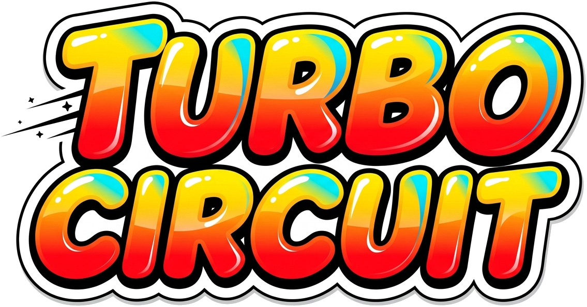

  <h3>🏎️ ドリフトを極め、アイテムで逆転せよ！爽快3Dポップ・カートレーシング 🏁</h3>

  <p>
    <b>1人プレイ・画面分割2P対戦・最大8人オンラインマルチプレイ完全対応！</b>
  </p>

  <p>
    
    
    
    
    
  </p>

</div>

---

## 🎮 ゲーム概要 (About)

**『Turbo Circuit（ターボ・サーキット）』** は、明るくポップなトイ・アーケード調の世界観で繰り広げられる本格3Dカートレーシングゲームです！

直感的で軽快な操作性をベースに、コーナーを華麗に滑り抜ける**ドリフトブースト**、息をのむ**ビッグジャンプ台**、そして一発逆転を狙える**アイテムバトル**を搭載。
白熱のフルグリッドレースが楽しめる**1人プレイ（グランプリ＆タイムアタック）**はもちろん、1台のPCで友達や家族と盛り上がれる**ローカル2P画面分割対戦**、さらには面倒なルーター設定なしで世界中のライバルと繋がれる**最大8人オンラインマルチプレイ（Unity Relay ルームコード対応）**まで、充実のゲームモードを収録しています！

<div align="center">
  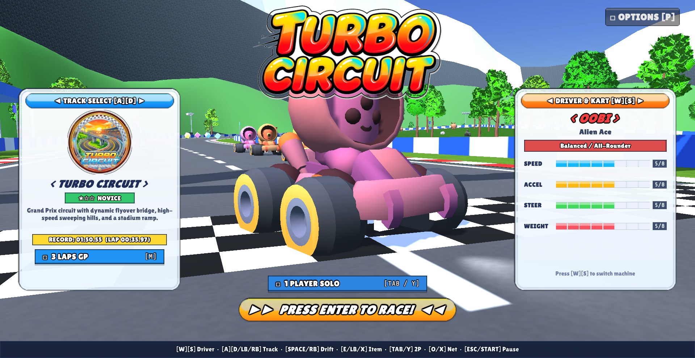
</div>

---

## ✨ 主な特徴 (Features)

- 🏎️ **爽快なアーケード物理＆ドリフトアクション**
  - ボタン1つでホップ＆ドリフト！タイヤの火花が青からオレンジに変わる瞬間に開放して強烈な「ミニターボ」を発動！
  - 各所に設置されたジャンプ台でのトリックや、スタートカウントダウンに合わせたロケットスタートなど、走りを突き詰めるテクニックが満載。

- 🗺️ **ギミック満載の5つの本格サーキット**
  - 緩やかな丘陵と高架橋立体交差が爽快な王道サーキットから、超巨大砂丘のジェットコースター、標高差35mの白銀雪山、サイバーなビル貫通トンネル、そして実在の道路網を忠実に再現した**「北海道大学 札幌キャンパス」**まで！

- 👾 **個性豊かな5人のドライバー＆専用カート**
  - 最高速重視、加速・ドリフト重視、鋭い旋回性能、重戦車級のヘビーウェイトなど、性能や操作感が異なる5タイプのマシンから選択可能。

- 💥 **戦況を一変させる4種類のアイテム**
  - ライバルを足止めする「バナナ」、前方カートを自動追跡する「ホーミングミサイル」、攻撃を防ぐ「シールド」、超高速ダッシュを決める「ターボ」！

- 👥 **いつでも・誰とでも遊べるマルチプレイ環境**
  - **1人プレイ**: 8台フルグリッドの白熱グランプリ ＆ 歴代ゴーストカーと競うタイムアタック
  - **画面分割2P対戦**: 1台のキーボードまたはゲームパッドを使ってその場ですぐに対戦！
  - **最大8人オンライン対戦**: Unity Relay によるルームコード共有で、ポート開放なしで誰でもワンクリック接続。空き枠はCPUが参戦！
  - **柔軟なキーコンフィグ**: キーボードおよび各種ゲームパッドに対応し、ゲーム内設定でいつでもキーバインドを変更可能。

---

## 📸 スクリーンショット (Screenshots)

<div align="center">

| 白熱の8台グランプリレース | 画面分割 2Pローカル対戦 |
|:---:|:---:|
|  | 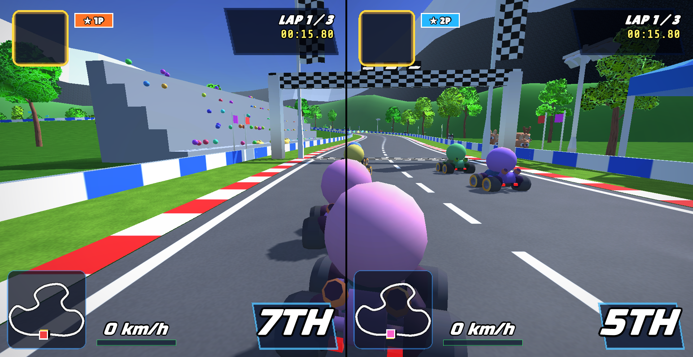 |

| 最大8人 オンラインロビー | 激戦のアイテムバトル |
|:---:|:---:|
| 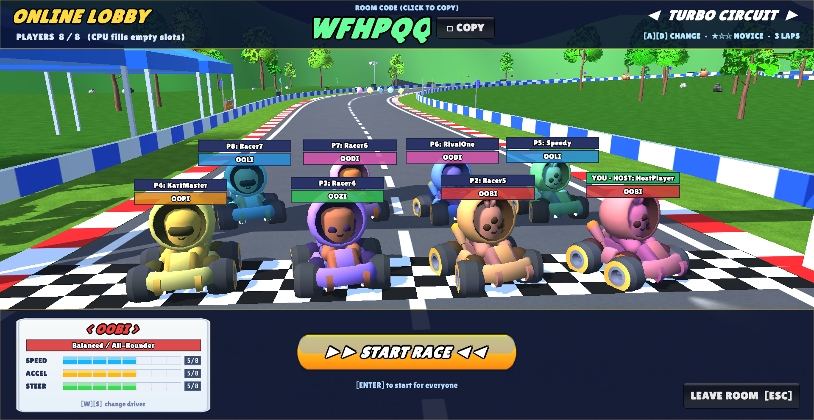 | 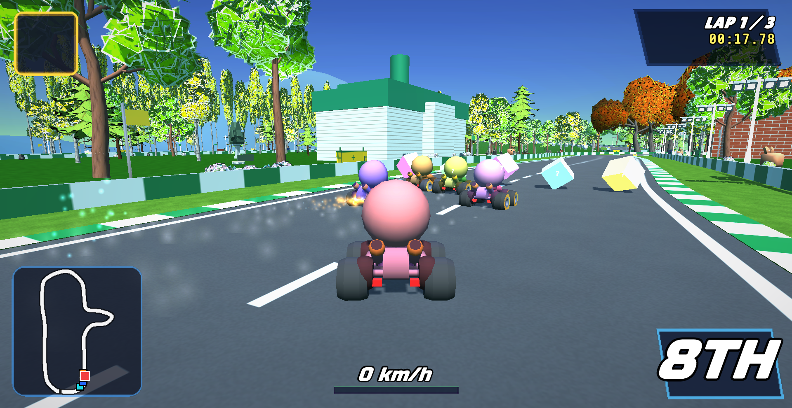 |

| レース結果・リザルト表 | キーコンフィグ・設定画面 |
|:---:|:---:|
| 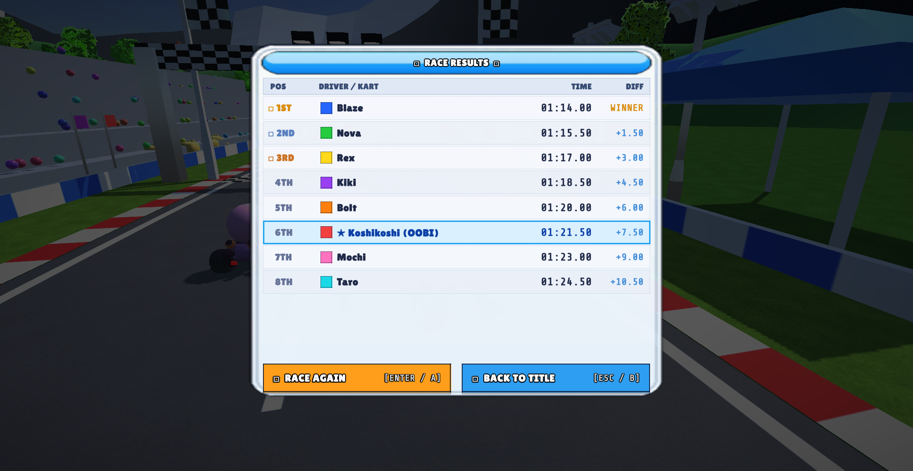 | 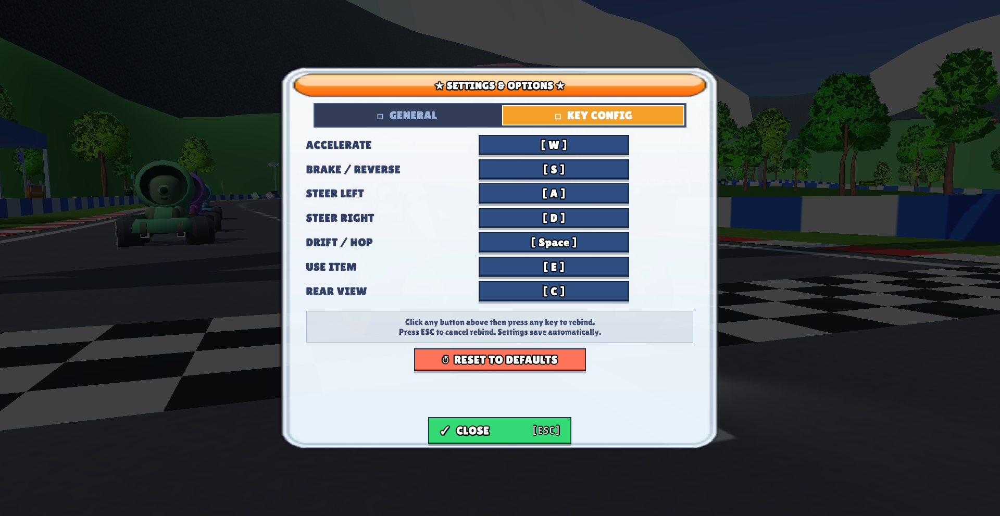 |

</div>

---

## 🏁 コース紹介 (Courses)

全5コース。各コースごとに独自の地形、高低差、ギミック、BGM、そして風景が広がっています。

<div align="center">

### 1. TURBO CIRCUIT (ターボ・サーキット)
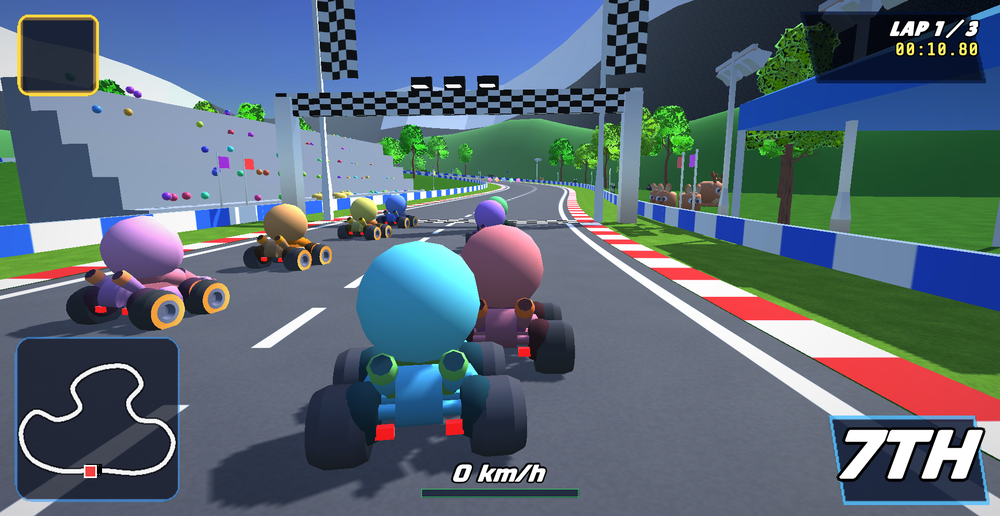

> **難易度**: ★☆☆ (NOVICE)  
> **特徴**: 緑豊かな丘陵地帯を疾走する王道グランプリコース。ダイナミックな高架橋の立体交差、高速S字コーナー、そして終盤のスタジアム・ビッグジャンプ台がレーサーを待ち受けます。

---

### 2. SUNSET DUNES (サンセット・デューンズ)
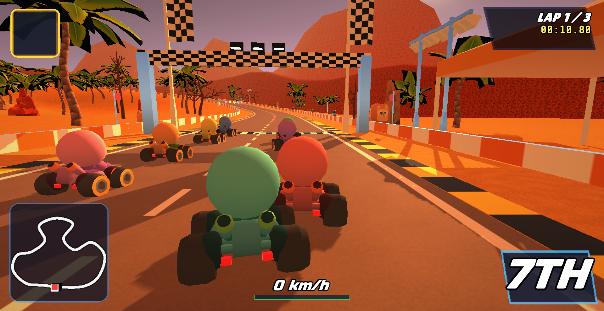

> **難易度**: ★★☆ (INTERMEDIATE)  
> **特徴**: 沈みゆく夕日と赤岩キャニオンが美しい砂漠コース。巨大砂丘を一気に駆け上がった後の超急降下ジェットコースターや、古代ピラミッド遺跡とオアシスを抜けるスリリングなコース設計！

---

### 3. FROST PEAK (フロスト・ピーク)
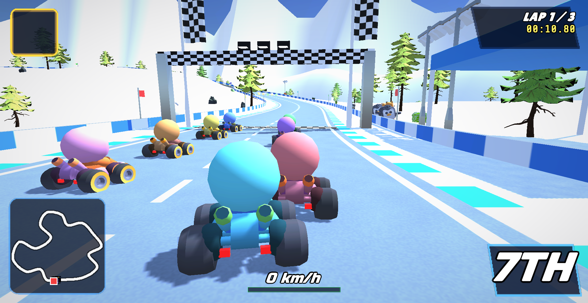

> **難易度**: ★★★ (EXPERT)  
> **特徴**: 標高差35mを誇る過酷なアルペン雪山クライム！雪煙舞う連続ヘアピン、氷河スロープ、そして断崖絶壁のクレバスを飛び越える決死のロングジャンプが待ち受ける超難関コース。

---

### 4. NEON METROPOLIS (ネオン・メトロポリス)
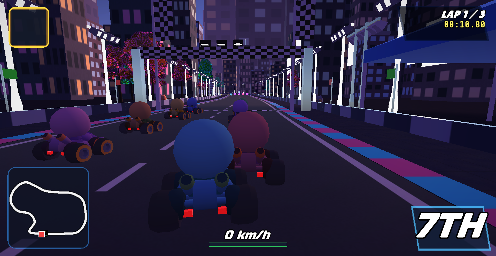

> **難易度**: ★★☆ (INTERMEDIATE)  
> **特徴**: ネオンきらめくサイバー未来都市の黄昏を駆け抜けるナイトレース。超高層ビルの谷間、高速高架ハイウェイ、そして摩天楼のビル群をそのまま貫通する近未来トンネルをフルスロットルで疾走！

---

### 5. HOKKAIDO CAMPUS (北海道大学 札幌キャンパス)
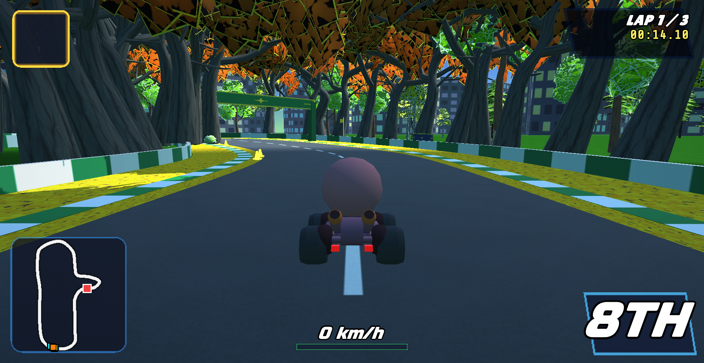

> **難易度**: ★★☆ (INTERMEDIATE)  
> **特徴**: 北海道大学札幌キャンパスの実在する道路・ランドマークを精密に再現！南端の正門・メインストリートから、エルムの森、クラーク像、黄金に輝く「北13条イチョウ並木」、歴史的建造物「第2農場モデルバーン」での大ジャンプ、そして西側の美しいポプラ並木通りを駆け抜けるスペシャルツアーコース！

</div>

---

## 🏎️ ドライバー＆マシン紹介 (Characters & Karts)

プレイヤーのドライビングスタイルに合わせて選べる5台の個性派マシン！

| ドライバー | マシン名 | 特徴・スタイル | スピード | 加速 | 旋回 | 重さ |
|:---:|:---:|:---|:---:|:---:|:---:|:---:|
| **Alien Ace** | **OOBI** | **バランス型 / オールラウンダー**<br>すべての性能が均等で癖がなく、初心者から上級者まで扱いやすいスタンダードマシン。 | 5/8 | 5/8 | 5/8 | 5/8 |
| **Pink Dash** | **OODI** | **加速＆ドリフト特化**<br>高い加速力とミニターボの伸びが抜群。コーナーの多いテクニカルコースで無類の強さを誇る。 | 4/8 | 7/8 | 6/8 | 3/8 |
| **Aero Sonic** | **OOLI** | **最高速特化型**<br>圧倒的なトップスピードを誇るハイスピードマシン。長いストレートでライバルを突き放す！ | 8/8 | 4/8 | 4/8 | 6/8 |
| **Racer Swift** | **OOPI** | **シャープハンドリング型**<br>抜群のステアリングレスポンス。急カーブやシケインも減速することなく鋭くインを突ける。 | 4/8 | 6/8 | 8/8 | 3/8 |
| **Cool Titan** | **OOZI** | **重量級＆高グリップ**<br>圧倒的な車重とタイヤグリップでコースアウトを防ぎ、他車との激しい競り合いでも押し負けないタフガイ。 | 6/8 | 3/8 | 4/8 | 8/8 |

---

## 🎁 アイテム一覧 (Items)

コース上に点在するレインボーの「？アイテムボックス」を通過するとランダムでアイテムを獲得！`[E]` / `[Ctrl]` キーで使用できます。

| アイコン | アイテム名 | 効果・使い方 |
|:---:|:---:|:---|
|  | **バナナ (Banana)** | 後方にトラップとして投下。後続車が踏むとスピンして大きく減速します。自分の後方を走るライバルの走行ラインに仕掛けよう！ |
| 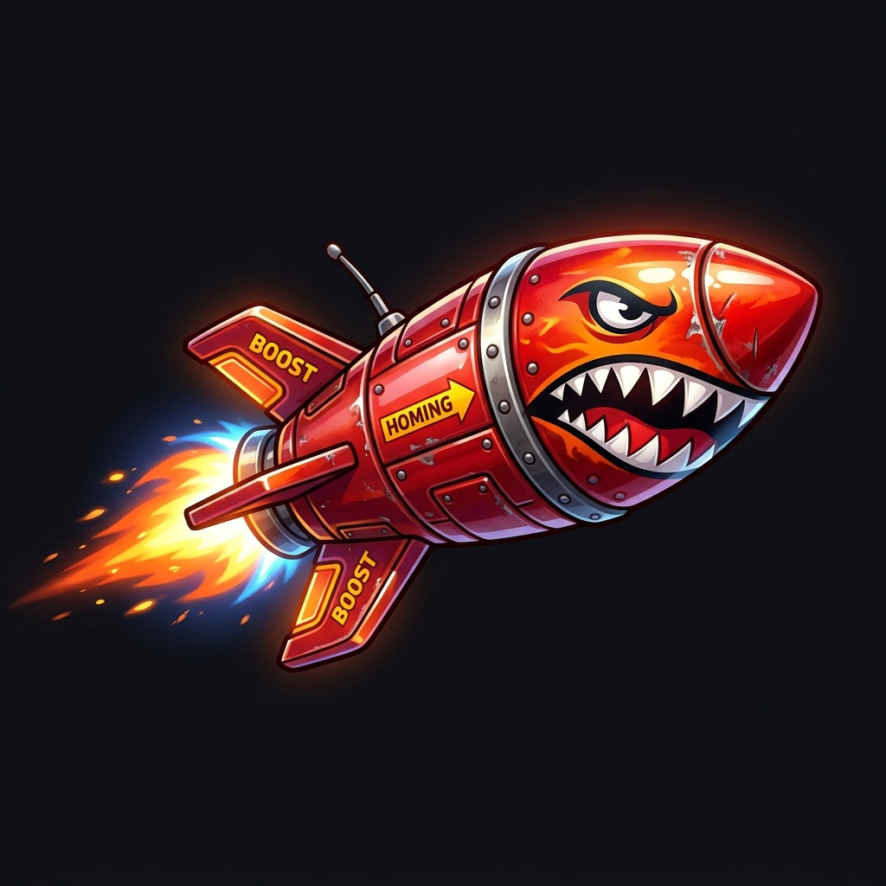 | **ホーミングミサイル (Missile)** | 前方を走るライバルカートを自動追尾して発射！直撃すると大爆発を起こし、相手をクラッシュさせます。前方の逆転に最適！ |
| 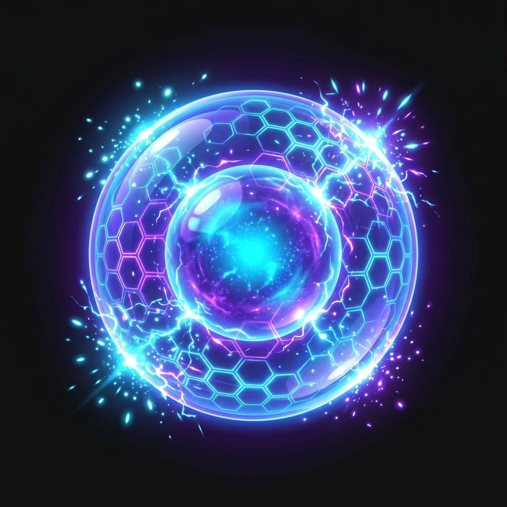 | **シールド (Shield)** | カートの周囲に防御バリアを展開。敵のミサイル攻撃やバナナの罠から1回だけ身を守ることができます。トップ独走時の守りの要！ |
| 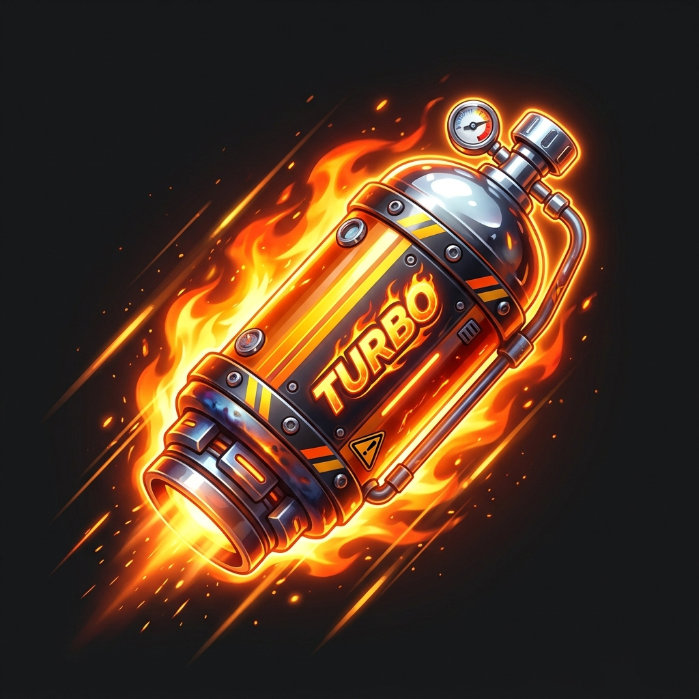 | **ターボ (Turbo / Nitro)** | 強烈なニトロパワーを噴射して瞬間急加速！直線での追い抜きや、芝生・ダートなどのオフロードを強引にショートカットする時に有効！ |

---

## ⌨️ 操作方法 (Controls)

キーボードおよび家庭用ゲームパッド（Xbox / DualShock / 各種DirectInputコントローラー等）に完全対応しています。

### メニュー操作
- **コース選択**: `A` / `D` または `←` / `→`
- **ドライバー/マシン選択**: `W` / `S` または `↑` / `↓`
- **プレイモード切替 (1P / 2P / タイムアタック)**: `Tab` または `M`
- **オンラインメニュー**: `O`
- **設定（キーコンフィグ）**: `P` またはポーズメニューから
- **レーススタート / 決定**: `Enter` / `Space`
- **戻る / ポーズ**: `Esc`

### レース中操作

| 操作アクション | 1人プレイ (キーボード) | 2P画面分割 P1 | 2P画面分割 P2 | ゲームパッド (推奨) |
|:---|:---:|:---:|:---:|:---:|
| **アクセル (前進)** | `W` または `↑` | `W` | `↑` | `RT` / `R2` / `Aボタン` |
| **ブレーキ / バック** | `S` または `↓` | `S` | `↓` | `LT` / `L2` / `Bボタン` |
| **ステアリング (ハンドル)** | `A` `D` または `←` `→` | `A` `D` | `←` `→` | 左スティック / 十字キー |
| **ドリフト / ホップ** | `Space` または `Shift` | `Space` / `L-Shift` | `R-Shift` / `.` | `RB` / `R1` |
| **アイテム使用** | `E` または `Ctrl` | `E` / `L-Ctrl` | `R-Ctrl` / `/` | `Xボタン` / `LB` |
| **バックミラー (後方視点)** | `B` | `B` | `End` | `Yボタン` / `R3` |
| **ポーズメニュー** | `Esc` | `Esc` | `Esc` | `START` / `Menu` |

> 💡 **キーのカスタマイズ**: タイトル画面の `[OPTIONS]` またはレース中ポーズの `[SETTINGS & KEYS]` から、お好みのキーボード配置にいつでも変更できます。

---

## 🌐 オンラインマルチプレイの遊び方 (Online Multiplayer)

ポート開放などの複雑なルーター設定は一切不要！Unity Relayによるルームコード機能で誰でも簡単にマルチプレイが楽しめます。

### ホスト（部屋を作る人）
1. タイトル画面で `[O]` キーを押してオンラインメニューを開きます。
2. **「HOST ROOM (RELAY)」** ボタンをクリックします。
3. 画面中央上に **6〜8文字のルームコード**（例: `WFHPQQ`）が発行・表示されます（クリックでクリップボードにコピー可能）。
4. 一緒に遊ぶフレンドにそのルームコードを伝えます。
5. 全員がロビーに参加したら、コースを選択して **「START RACE」** を押すとレースが一斉にスタートします！

### クライアント（部屋に参加する人）
1. タイトル画面で `[O]` キーを押してオンラインメニューを開きます。
2. ホストから教えてもらったルームコードを入力欄に入力します。
3. **「JOIN ROOM」** を押すだけで、ホストのロビーに瞬時に合流できます！

> 💡 **少人数でも白熱！**:
> - 参加人数が8人に満たない場合、残りの空きスロットは自動的にCPUカートが参戦するため、2〜3人などの少人数でも常に白熱の8台レースが楽しめます。
> - 同一LAN内やVPN環境（Tailscale等）で遊ぶ場合は、「IP DIRECT」による直接接続も利用可能です。

---

## 📥 ダウンロード & プレイ手順 (Download & How to Run)

### 動作要件
- **OS**: Windows 10 / 11 (64-bit)
- **DirectX**: Version 11 または 12
- **コントローラー**: キーボード、または一般的なゲームパッド（Xbox 360/One/Series, PS4/PS5, 一般的なUSBコントローラー対応）

### 起動手順
1. 本リポジトリの [Releases](../../releases) から最新の `TurboCircuit-win64.zip` をダウンロードします。
2. ダウンロードした ZIP ファイルを任意のフォルダに展開（解凍）します。
3. 展開したフォルダ内の **`TurboCircuit.exe`** をダブルクリックして実行すると、すぐにゲームが始まります！

---

## 🛠️ 開発者向け情報 (Building from Source)

ソースコードから自身でビルドを行う場合の手順です。

### 動作環境
- **Unity**: `6000.6.3f1` (Universal Render Pipeline / URP)

### コマンドラインでのヘッドレスビルド
PowerShell または コマンドプロンプトから以下のコマンドを実行します：

```powershell
"C:\Program Files\Unity\Hub\Editor\6000.6.3f1\Editor\Unity.exe" -batchmode -nographics -quit -projectPath . -executeMethod BuildTool.BuildWindows -logFile -
```

ビルド成果物は `Build/Windows/` に出力されます。

### 自動スクリーンショット撮影テスト (`-autoshot`)
```powershell
pushd Build\Windows
.\TurboCircuit.exe -autoshot
popd
```

---

## 📜 クレジット & ライセンス (Credits & License)

本ゲームは以下の素晴らしいオープンアセットおよびクリエイターの作品を使用・リスペクトして制作されています。

- **3Dモデル & 小物 & 動物**:
  - [Kenney](https://kenney.nl/) (CC0) - Kart Kit, Cube Pets, Circuit Props
  - [Quaternius](https://quaternius.com/) (CC0 / MIT) - Stylized Nature Kit (樹木・植物・岩石モデル)
- **効果音 (SFX)**:
  - [Kenney](https://kenney.nl/) (CC0) - Interface Sounds, Impact Sounds, Sci-fi Sounds
- **BGM (Music)**:
  - OpenGameArt CC0 楽曲（cynicmusic、Julie Damsgaard、Centurion_of_war、wipics）
  - 詳細な曲名および配信元リンクは [Assets/Resources/Audio/CREDITS.md](Assets/Resources/Audio/CREDITS.md) をご覧ください。

---

<div align="center">
  <b>Turbo Circuit</b> - Enjoy High-Speed Racing! 🏁
</div>
